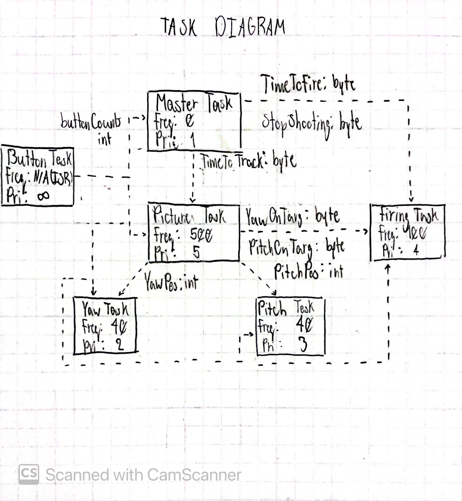

# ME405 Term Project

### Dueling Robot
The Dueling Robot (an automated nerf turret that tracks a target using an infrared 
camera and shoots them) was designed as the end of term project for ME405 to test 
our knowledge and abilites on the material taught this quarter. It is to be used 
by us and the ME405 lab.

### Hardware Design
Our design consists of a large, circular bsase that connects to a mating section 
through a custom-created ball-bearing (two 3d printed runners with a set of metal 
spheres between) and a pivot joint attached to the base that allows the nerf gun to 
pivot up and down. The base is driven by one of the provided Ametek/Pittman
motors whose 3D-printed gear mates to the inner teeth of the base (already created;
was originally the magazine for the nerf gun before being altered for our purposes)
to cause rotation in the yaw direction. The pivot joint was mounted to the base using
a set of screws and causes rotation of the gun in the pitch direction through the
use of the other provided Ametek/Pittman motor and a mating gear (laser cut from 
acrylic) that is directly screwed into and attached to the nerf gun with the use 
of 2 screws.
[INSERT IMAGES OF DESIGN HERE]

### Software Design
The dueling robot uses a set of tasks (specified below) called in a main program 
to run and target an opponent succesfully. The robot uses MicroPython to control
two motors and adjust the pitch and yaw axes in order to follow the target (found
with the provided thermal camera).

  
The task diagram for the dueling robot, the frequency each task is set to run 
at is currently being decided.

### Results
After creating our mechanical design and troubleshooting our software and code, we
were able to successfully track and hit our target multiple times during the dueling
competition (once first, and once second). We did have two rounds where our robot 
missed our target, however the shots were only slightly off from the target (which 
leads us to believe that heat fluxuations in the room caused by a gathering of people
near where the target chose to move to may have been the cause). During the final 
phase of testing, we found our robot to be very accurate - more so than it appeared
in the competition - as it successfully tracked and shot the testing target numerous
times without fail (this was with limited gatherings of external heat sources).

### Lessons Learned and Recommendations
After completing this lab, we have learned how to create motor controller classes
for both direct DC and servo motors and how to adapt this code to multiple other 
types, as well as how to integrate encoders into code and use them to track/measure
position, create cooperative tasking classes, and how to utilize other components 
(such as an infrared camera) to create complex, moving systems. What seemed to work 
best for our device was the creation of as few external classes as possible (to avoid 
memory allocation issues with the Nucleo) and the creation of separate conditional 
code and Kp/motor constant values for the rotation of our device in different directions
(in order to account for the backlash in the gearing system of the pitch axis).
Our biggest recommendation for anyone attempting to build on our work would be to 
redraw the FSM's in order to fully understand the flow of our code, before attempting
to improve on or utilize it, as this is a complicated program that uses multiple 
different classes cooperatively.
