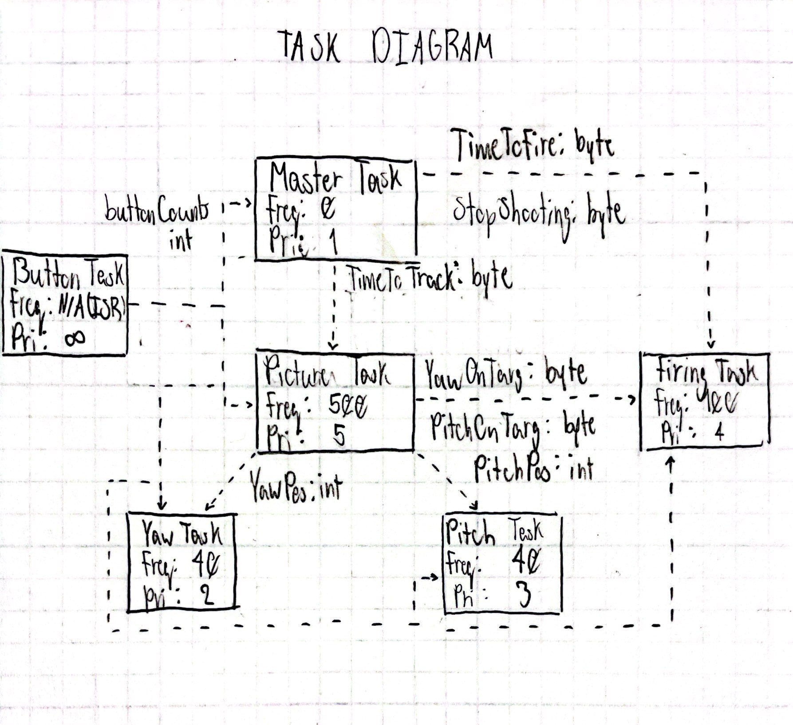

# ME405 Term Project

### Dueling Robot
@section Software Design
The dueling robot uses a set of tasks to run and target an opponent 
succesfully. The robot uses MicroPython to control two motors and adjust the
pitch and yaw axis in order to follow the target found in the provided
thermal camera.

  
The task diagram for the dueling robot, the frequency each task is set to run 
at is currently being decided.

### Button Task
The button task shares the status of the button to the camera task. When the
button is in its 'On' state the flywheels are primed and the camera is turned
on. If the button is toggled again, the button is set to 'Off' and the 
flywheel and camera are both shut off.

  
The finite state machine for the button task.

### Camera Task
The camera task queues the location of the target in its field of view with
both the Yaw Axis Controller and the Pitch Axis Controller.

### Yaw Task
The yaw task takes the current horizontal position and uses the control loop
try to aim at the target. If Yaw Task is at the same position of the target
for several cycles, then the target is located in the horizontal axis and the
Yaw Task shares Y_OnTarg to high to the Firing Task.

### Pitch Task
The pitch task takes the current vertical position and uses the control loop
try to aim at the target. If Pitch Task is at the same position of the target
for several cycles, then the target is located in the vertical axis and the
Pitch Task shares P_OnTarg to high to the Firing Task.

#Firing Task
The firing task takes the data shared by both the Yaw Task and the Pitch Task
in the form of the two booleans: Y_OnTarg and P_On_Targ respectively. If 
both booleans are True then the firing task commands the firing motor to 
articulate a dart into the rotating flywheels. 

  
The finite state machine for the firing task.
